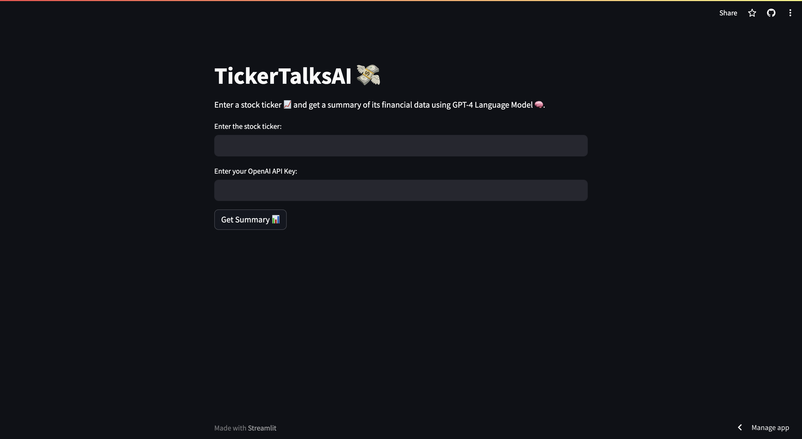

<a href="https://tickertalks.streamlit.app/">
  
<a>

# TickerTalksAI

With the overwhelming amount of data and news that can impact stock prices, it became imperative to create a tool that could assist both investors in making informed decisions. 
An ideal solution would democratize access to sophisticated stock analysis, allowing users to leverage advanced technologies to keep pace with the professionals.

`TickerTalksAI` fills this gap by utilising the powerful GPT-4 Language Model from OpenAI as its backbone, which not only summarizes financial data but also analyzes 
recent news to provide a comprehensive stock outlook.

## 🌐 Table of Contents

- [Background](#-background)
- [Features](#-features)
- [Getting Started](#-getting-started)
- [Usage](#-usage)
- [Built Using](#%EF%B8%8F-built-using)
- [Contributors](#-contributors)

## 📜 Background

The inspiration for this project is rooted in the recognition that the realm of financial investment is rife with complexity characterized by a deluge of data points 
and continuous news streams which are often inaccessible to the average person. 

This project is conceived as a bridge across this divide, harnessing the power of OpenAI's GPT-4 Language Model to analyze and synthesize financial data and news into 
actionable insights. It aspires to democratize financial analysis, allowing users to make more informed decisions and engage with the stock market in a more meaningful way.

`Because everyone deserves a fair shot at financial prosperity.`

## 🚀 Features

1. Integration with Yahoo Finance API for real-time stock data retrieval.
2. Interactive stock chart display for easy visualization of stock performance over the last three months.
3. OpenAI's GPT-4 model for processing and analysing summarisations.
4. Responsive design for an optimal user experience across various devices and screen sizes.
5. Minimalist UI design focused on usability and straightforward navigation.

## 🏁 Getting Started

### Prerequisites

- [OpenAI API Key](https://platform.openai.com/account/api-keys): For accessing AI models developed by OpenAI.

### Installation & Configuration

1. **Clone the Repo**

   `git clone https://github.com/abhishek-x/TickerTalksAI.git`

2. **Install packages**

   `pip install -r requirements.txt`

3. **Run `app.py` locally**

   `streamlit run app.py`

## 🎈 Usage

- Enter the **Stock Ticker**.
- Enter the **OpenAI API key**.
- Click on **Get Summary** Button.

## ⛏️ Built Using

`Python 3.9`, `GPT-4`, `Yahoo Finance API`, `BeautifulSoup`, `Plotly`, `Streamlit`

## 👥 Contributors

<table>
  <tr>
    <td align="center"><a href="https://github.com/abhishek-x"> <b>Abhishek Aggarwal</b></a> </td>
  </tr>
</table>
