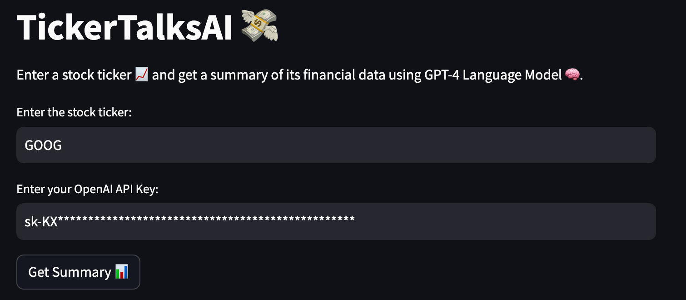
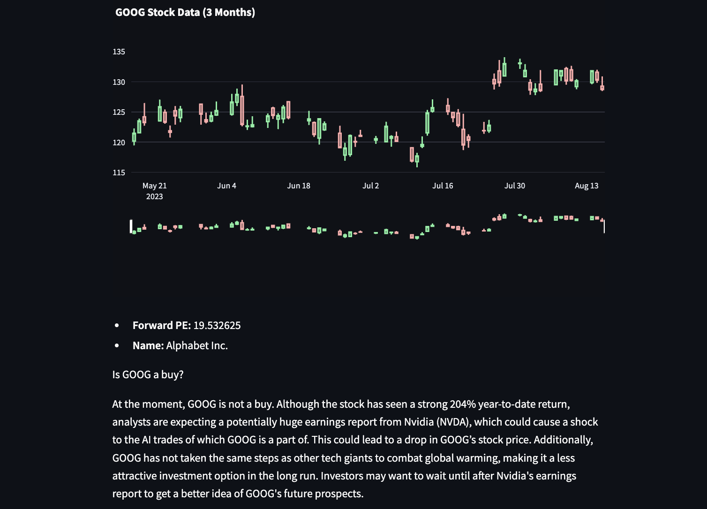

<br/>
<p align="center">
  <a href="https://tickertalks.streamlit.app">
    
  </a>

  <h3 align="center">TickerTalksAI</h3>

  <p align="center">
    Get summaries of the stock's financial data using GPT-4 Language Model!
    <br/>
    <br/>
    <a href="https://github.com/abhishek-x/TickerTalksAI/tree/main"><strong>Explore the docs »</strong></a>
    <br/>
    <br/>
    <a href="https://tickertalks.streamlit.app">View Demo</a>
    .
    <a href="https://github.com/abhishek-x/TickerTalksAI/issues">Report Bug</a>
    .
    <a href="https://github.com/abhishek-x/TickerTalksAI/issues">Request Feature</a>
  </p>
</p>

## About The Project

Stock summarization app that retrieves financial data from Yahoo Finance for stock ticker and summarizes recent news related to the stock using OpenAI language models.

## Built With

Languages: Python 3.9
LLM: GPT-4
Data: Yahoo Finance API

### Prerequisites

Get your OpenAI API key from [OpenAI](https://platform.openai.com/account/api-keys)

### Installation

1. Clone the repo

```sh
git clone https://github.com/abhishek-x/TickerTalksAI.git
```

3. Install packages

```sh
pip install -r requirements.txt
```

4. Run `app.py` locally

```sh
streamlit run app.py
```

## Usage



1. Enter the **Stock Ticker**.
2. Enter the **OpenAI API key**.
3. Click on **Get Summary** Button.

## Results



## License

Distributed under the MIT License. See [LICENSE](https://github.com/abhishek-x/TickerTalksAI/blob/main/LICENSE) for more information.

## Authors

* **[Abhishek Aggarwal](https://github.com/abhishek-x)** - *Comp Sci Student*
